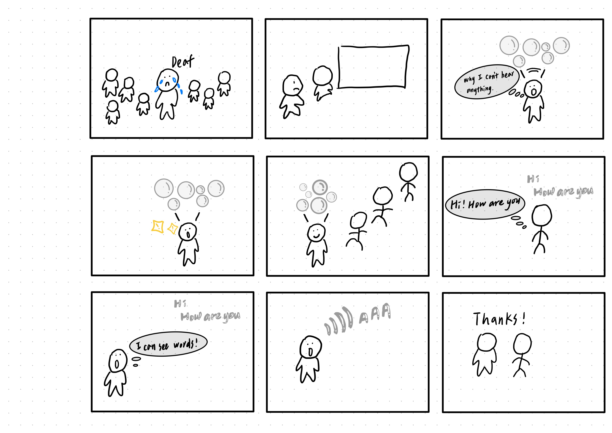

# Recreating the Masters of Interactive Light

_This project is to be done in teams of 2._

**Tzu-Yao (Regina) Chang (tc845), Monica Wei (tw628)**

**THE MASTERWORK YOU DREW FROM THE HAT: MESSA DI VOCE**

---

One way to understand greatness is to look to the greats. Just as painters learn
the technique and artistry of the old masters by recreating their paintings, so
too shall we come to understand computer-mediated interaction by recreating the
interactive masterworks of our time.

This week, every team will draw a different masterwork from a hat. Some are
conceptual pieces, some are historical works, some are modern-day products —
but they all share one thing: **their central mode of interaction is carried by
light.** Think of Tinker Bell in the original stage production of *Peter Pan*,
represented by nothing more than a darting circle of light from an off-stage
mirror. There was no actor playing Tinker Bell; she existed entirely through the
way the other characters interacted with that light.

Your job is to recreate the *interaction* of the piece you drew — not to build a
museum-grade replica, but to stage the moment that makes it what it is. Someone
who knows your piece should watch your recreation and recognize it instantly.
Someone who has never heard of it should walk away understanding what it is
famous for.

You will do this using the interaction staging techniques we will use all semester: a
storyboard, some acting, a phone standing in as a controllable light (the
*Tinkerbelle* tool), a hidden human "wizard" driving it, a costume, and a
recorded video.

*Make sure you read all the instructions and understand the whole activity
before starting!*

## Prep

To start, you will need:

1. Read about Git [here](https://git-scm.com/book/en/v2/Getting-Started-What-is-Git%3F).
2. Set up your own Github "Lab Hub" by forking the [Interactive-Lab-Hub repository](https://github.com/IRL-CT/Interactive-Lab-Hub). To get lab updates, simply use [GitHub's "Sync fork" button](https://docs.github.com/en/pull-requests/collaborating-with-pull-requests/working-with-forks/syncing-a-fork) when new content is available.

3. Set up your `README.md` so it has your name and links to this lab. Learn to
   format a README [here](https://docs.github.com/en/get-started/writing-on-github/getting-started-with-writing-and-formatting-on-github/basic-writing-and-formatting-syntax).
4. **Draw your masterwork from the hat and write it at the top of this file.**
   Whatever you drew is yours — lean into it.

## Materials

For this lab you will need:

1. Paper, markers/pens, scissors
2. A smartphone with a browser that can display a webpage (your stand-in "light")
3. A computer to host the control webpage
4. Found objects and materials to **costume your phone so it looks like the
   device in your masterwork** — doll clothes, a paper lantern, a bottle, foil,
   a cardboard shell, whatever it takes. Be resourceful.

## Deliverables

Submit all of the following in this lab folder of your Lab Hub, as links or
uploaded files. **Each group member posts their own copy to their own Github repo**, even if the work is
shared.

1. A short **research write-up** of your masterwork (what it is, when, who made
   it, and — most importantly — what the interaction is)
2. **3 iterated storyboards** of the interaction in the masterwork
5. A **video sketch** of your prototyped interaction
6. Any **reflections** on the process

Labs are due on Mondays. Make sure this page is linked from your main class hub
page.

---

# The Report

## Part 0. Know Your Master

Before you prototype anything, get intimately acquainted with the piece you
drew. Do real research. You are looking less for trivia than for the *shape of
the interaction*:

- What inputs are available to the user? What responses does the work give?
- Who is present, and how does the piece color the relationships between them?
- What is the piece famous for? What are its strengths and its weaknesses?

  Sometimes the details of how the interaction worked are lost in history. Try filling it in with your imagination!

**Describe your masterwork here, in your own words. What is the core interaction
someone would recognize it by?**

| Input | Response |
|---|---|
| Performer makes a sound | A visual forms appears |
| Volume changes | Changes the size or behavior of the visuals |
| Pitch changes | Changes the shape or movement of the visuals |
| Performer changes their voice after seeing the visual | Creates a continuous feedback loop |

- The vocal performers or audience can interact with it. The piece creates a feedback loop between the performers and the device. When performers make sounds, the device turns those sounds into visual forms. When performers see the visual forms, they change their voice volume or pitch in response to them.

- Messa di Voce is famous for translating sounds from people or the environment into real-time interactive visuals. Instead of simply hearing sounds, performers can see the visuals and interact with them using their voices and bodies.

- Strengths: It makes invisible things, like sound and changes in volume, visible. It also makes sound last longer by turning something temporary into a visual form that can stay in the space and be interacted with. It also provides another way to perceive sound, helping people who may not hear the sound clearly or notice changes in it.

- Weakness: The interaction is mostly limited to sound, body movement, and visual feedback. Adding other types of interaction, such as touch or haptic feedback, could make the experience more immersive and allow people to interact with sound in more ways.

## Part A. Plan

For your masterwork, reconstruct the interaction as a scene:

- **Setting:** Where and when does this interaction happen? (a jungle, a kitchen,
  a spaceship corridor, a nightclub, a harbor at night)
- **Players:** Who is involved? Who else is present? Think through everyone in
  the setting, not just the primary user.
- **Activity:** What is happening between the players and the light?
- **Goals:** What is each player trying to do?

**Describe your setting, players, activity, and goals here.**

- **Setting:** The house at cornell tech
- **Players:** 
   A (in Scene 1): Regina  
   B (in Scene 2): Monica
- **Activity:** 
  - In Scene 1, A walks into the scene and makes sounds. The sounds are transformed into visual forms that appear and remain around A.
  - In Scene 2, B makes sounds and generates ripple-like visual forms. The ripples spread through the space and interact with another performer.
  - In Scene 3, B generates a visual form that travels toward A. The visual form hits A, and A reacts as if the visual form physically pushes them out of the scene.
- **Goals:**
  The goal is to explore how sound can be transformed into visible forms and how people can interact with these forms in different ways. The visual forms make sound feel like something that can remain in space, move between people, and even have a physical effect on others.

Now **sketch a 3 storyboards** of the interaction you are recreating. (The number may depend on the thing you drew, but stretch your thinking!) They
don't need to be beautiful, but they must capture and communicate not only the behavior of the light, but how it affects
and the people around it. If you're new to storyboarding, read
[this explanation](https://www.nngroup.com/articles/storyboards-visualize-ideas/).

**Include pictures of your storyboards here.**

Use the storyboards to decide what interaction to prototype.

**Summarize the feedback you got here.**
Since Messa di Voce is a relatively lesser-known work, people who watched our recreation for the first time could not immediately recognize what we were recreating. However, they still found the interaction interesting and understood that the performers’ sounds were connected to the visual forms. After watching the original Messa di Voce, they could clearly see the similarities and understand how our recreation captured the main idea of transforming sound into interactive visual forms.

## Part B. Act out the Interaction

Physically act out the interaction you planned. For now, just pretend the light
is doing what you've scripted — a person can wave a flashlight, or you can narrate
it aloud.

**Are there things that seemed better on paper than when acted out?**

It was difficult to show the scene where the ripple-like visual form hits the performer. It was easy to show in the storyboard, but when we acted it out, it was hard to make the interaction look realistic.

**Did new ideas about the piece surface once you were on your feet?**

When sound becomes something visible and physical, it changes how people interact with it. We realized that people could react to sound as if it were a physical object, such as avoiding it, being hit by it, or using their bodies to interact with it.

**Are there key moments in the interaction where things could go in a different direction?**

When a visual form moves toward another performer, they could react in different ways, such as avoiding it, ducking under it, jumping over it, or moving toward it. They could also make their own sound to create another visual form to block or push back against the incoming one. This could make the interaction less sequential and more interactive.

Iterate your storyboards to capture key non-sequential aspects of the interaction. 

## Part C. Prototype the Light (light first!)

Use your smartphone as the light of your device. Open the browser on your phone
to act as the "light," and use the remote control interface on your computer to
change that light. Code and setup instructions for the *Tinkerbelle* tool are
[here](https://github.com/IRL-CT/tinkerbelle) (we invented this tool for
this lab). If you hit technical trouble, a manually or remotely controlled light
switch, dimmer, or lamp is a fine substitute.

**Get the light interaction working before anything else.** Your grade this week
rides on the *light* being recognizable — the color, the rhythm, the timing, the
way it answers a person. Only once your light interaction genuinely reads as your
masterwork should you consider layering in a second modality (sound, vibration,
motion). If in doubt, keep polishing the light. The other modalities are next
week's business.

## Part D. Wizard the Device

Set up a "wizard" arrangement so one person can secretly drive the light while
another acts with it — this is how you make the device feel alive without
building any real electronics. (Zoom works well for recording; you can pin the
video feed of whichever scene you want to capture.)

**Include your first attempts at recording the wizarded set-up here.**
We used the light from a computer screen as the light source and paper cutouts to create the visual forms. By blocking and allowing light to pass through different parts of the paper cutouts, we created different light patterns.

## Part E. (optional) Costume the Device

Only now should you worry about what the device looks like. Costume your phone so it reads
as the object from your masterwork — HAL's eye, a Simon shell, a paper-lantern
Tinker Bell, an Ambient Orb, a lighthouse, a jack-o'-lantern, whatever you drew.

Think about the world your device lives in: could that environment overheat it?
Is water a danger? Does it need to be loud and bright for an emergency, or quiet
and calm for a bedroom?

**Include sketches/photos of what your device might look like here.**

**What concerns or opportunities shaped the way you designed its look?**

## Part F. Record

**Record your prototyped interaction as a video sketch.** Aim for the bar from
the top of this lab: a viewer who knows the piece should recognize it; a viewer
who doesn't should come away understanding what it's famous for. How might you illustrate the non-sequential aspects of the interaction in the sketch?

**Include your video here.**

https://github.com/user-attachments/assets/7ed04e10-f1fb-431f-8f7e-79d577e45c55

**Please indicate who you collaborated with on this lab.** Be generous in
acknowledging their contributions, and credit any other influences (YouTube,
Github, Twitter, a friend who lent you a lamp) that informed your recreation.

---

# Part 2 — ReMastering the light

*This describes the second week's work for this lab activity.*

## Prep (before the next lab)

Find three other groups. (How? Maybe Slack?) Visit their Lab Hub pages, watch their videos, and give them reactions and feedback: tell them what you saw happening, guess the masterwork and the goals of the characters, and ask about anything that wasn't clear.

**Who were the other groups you kibitzed with? Add links to their project pages here.**
1. https://github.com/Cyalisonliu/Interactive-Lab-Hub/tree/Fall2026/Lab%201
2. https://github.com/aurorajxshen/Interactive-Lab-Hub/tree/Fall2026/Lab%201
3. https://github.com/anihadagali7/Interactive-Lab-Hub/blob/anihadagali7-Aug26-Lab/Lab%201/README.md

**Summarize the feedback you got from your partners here.**
The feedbacks I got were mostly positive. They liked the animation and storytelling, especially how the bubbles came out of the person and how the visual objects changed their sizes and shapes based on the sounds. They also thought the stop-motion animation was a creative way to present the idea without being limited by a big screen or dark room.

They also pointed out some parts that could be clearer. For example, the “Master of Light” was not immediately recognizable, and it was a little confusing what caused the circles to appear at the beginning. They also suggested exploring more everyday applications, such as lamps, room projections, conferences, or art performances. Another interesting idea was to make the project more portable, such as using a wearable projector to help people with aphasia communicate through visuals.

## Remix, Update, or Critique the Master

Now that you understand your masterwork from the inside, respond to it. Do the
recreation again, but this time make it your own — pick one of these moves (or
combine them):

1. **Remix the modality.** Your recreation no longer has to (just) use light. Use
   vibration, sound, motion, heat — whatever best carries the interaction. Feel
   free to fork and modify the Tinkerbelle code. (Add your updates to this lab's folder!)
2. **Update it.** Redesign the piece for today's context, or for a setting its
   creators never imagined (the piece with roommates in the room, with children
   present, on a phone, in a car).
3. **Fix its weaknesses.** You identified this master's strengths and weaknesses
   in Part 0 — now address a weakness, or push a strength further.

We will grade this second pass with an emphasis on **creativity** and on how well your response engages with what your master was really doing.

**Document everything here — especially the storyboard and video. Photos of the
prototype are great too.**

---

*Assignment lineage: this lab merges "Staging Interaction" (Interactive Lab Hub)
with "Recreating the Masters" (Interaction Design Studio, Profs. Scott Minneman &
Wendy Ju). Massive list of interactive light masterworks generated by Claude.ai.*
