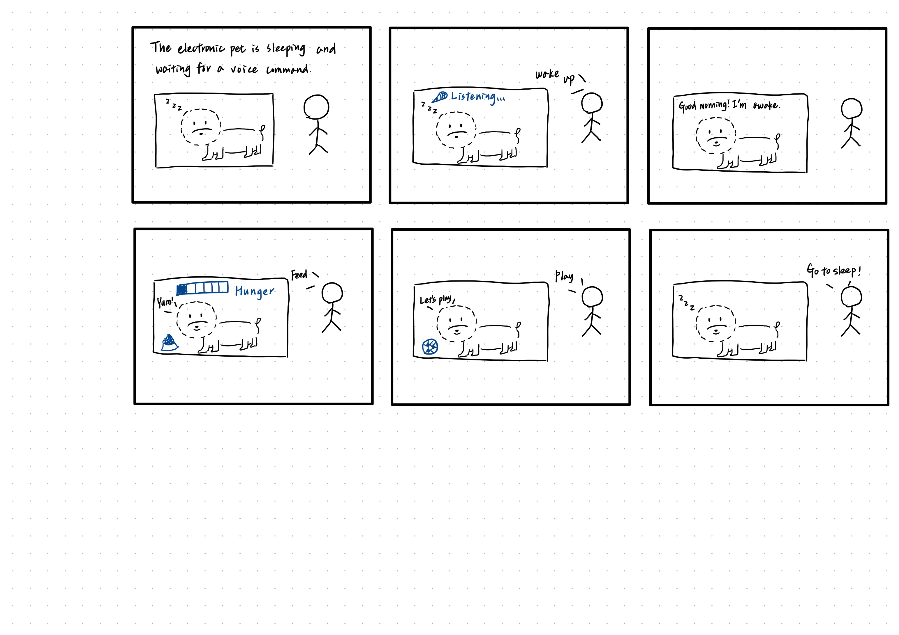
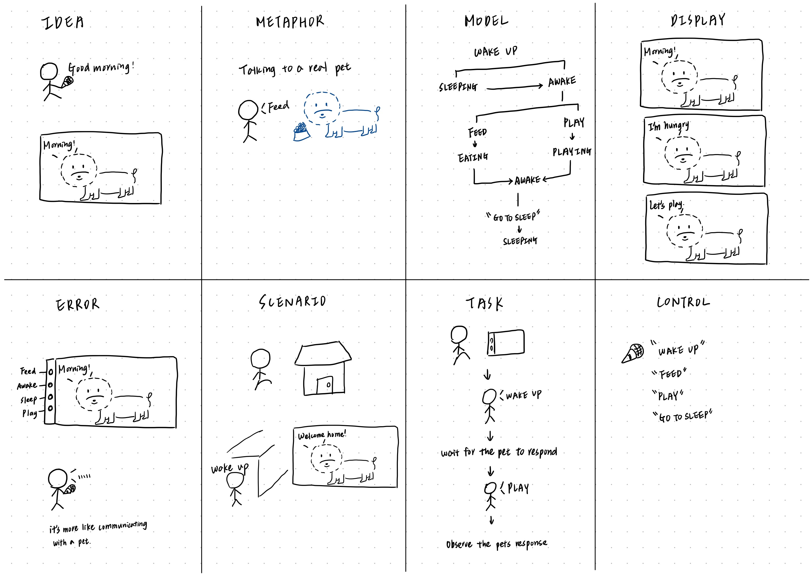
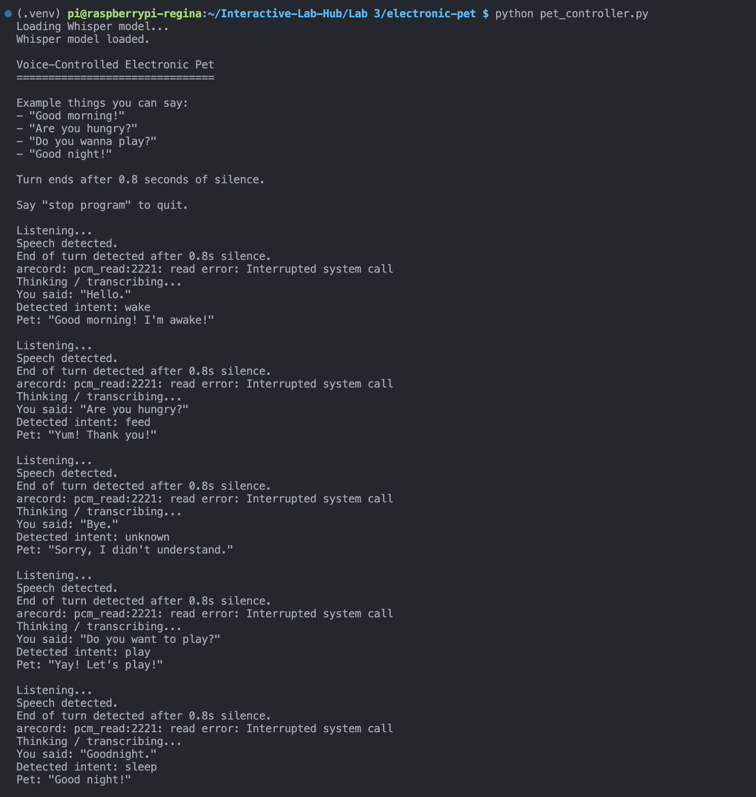

# Chatterboxes

**NAMES OF COLLABORATORS HERE**

<!-- [](https://youtu.be/LZ0VJClIlRI?si=Yy84mcyVYuVV19mn)

In this lab, we want you to design interaction with a speech-enabled device — something that listens and talks to you. This device can do anything *but* control lights (since we already did that in Lab 1). First, we want you to storyboard what you imagine the conversational interaction to be like. Then you will use wizarding techniques to elicit examples of what people might say, ask, or respond. We then want you to use the examples collected from at least two other people to inform the redesign of the device.

We will focus on **audio** as the main modality for interaction to start; these general techniques can be extended to **video**, **haptics** or other interactive mechanisms in the second part of the Lab.

A note on what you are building with. Speech interfaces are usually taught as two boxes — speech-in, speech-out — and that framing hides the part that actually determines whether an interaction works. Between listening and speaking sits the question of **whose turn it is**: when does the device decide you have finished talking, and how long does it make you wait before it answers? This lab gives you direct control over both, and we will ask you to notice what changes when you move them. -->

<!-- ## Prep for Part 1: Get the Latest Content and Pick up Additional Parts

Please check instructions in [prep.md](prep.md) and complete the setup.

### Pick up Web Camera If You Don't Have One

Students who have not already received a web camera will receive their Webcam and at the beginning of lab. If you cannot make it to class this week, please contact the TAs to ensure you get these.

### Get the Latest Content

As always, pull updates from the class Interactive-Lab-Hub to both your Pi and your own GitHub repo.

**\[recommended\]** Option 1: On the Pi, `cd` to your `Interactive-Lab-Hub`, pull the updates from upstream (class lab-hub) and push the updates back to your own GitHub repo. You will need the *personal access token* for this.

```
pi@ixe00:~$ cd Interactive-Lab-Hub
pi@ixe00:~/Interactive-Lab-Hub $ git pull upstream Fall2026
pi@ixe00:~/Interactive-Lab-Hub $ git add .
pi@ixe00:~/Interactive-Lab-Hub $ git commit -m "get lab3 updates"
pi@ixe00:~/Interactive-Lab-Hub $ git push
```

Option 2: On your own GitHub repo, create a pull request to get updates from the class Interactive-Lab-Hub. After you have the latest updates online, go to your Pi, `cd` to your `Interactive-Lab-Hub` and use `git pull`. -->

---

# Part 1
<!-- 
## Setup

Create and activate a virtual environment for this lab:

```
pi@ixe00:~$ cd Interactive-Lab-Hub/Lab\ 3
pi@ixe00:~/Interactive-Lab-Hub/Lab 3 $ python3 -m venv .venv
pi@ixe00:~/Interactive-Lab-Hub/Lab 3 $ source .venv/bin/activate
(.venv) pi@ixe00:~/Interactive-Lab-Hub/Lab 3 $
```

Install the Python dependencies:

```
(.venv) $ pip install -r requirements.txt
```

This takes a few minutes. If you would like it to take considerably less time, [`uv`](https://docs.astral.sh/uv/) is a drop-in replacement for `pip` that is dramatically faster on the Pi:

```
(.venv) $ pip install uv && uv pip install -r requirements.txt
```

Then run the setup script, which installs the classic speech synthesizers, downloads the voice activity detection model, and pre-fetches a neural voice and a speech recognition model so you are not waiting on downloads during lab:

```
(.venv):~$ cd speech-scripts
(.venv) $ ./setup.sh
```

Check your audio devices before going further. `arecord -l` lists capture devices and `aplay -l` lists playback devices; if your webcam microphone or Bluetooth speaker does not appear, fix that first — every script below assumes the system defaults are the ones you want. -->

## A. Text to Speech
<!-- 
Your Pi can speak in several quite different ways, and the differences are audible in a way that matters for design. In `speech-scripts/` there are shell scripts for each.

### The classic engines

```
(.venv) $ cd speech-scripts

(.venv) $ sudo apt update
(.venv) $ sudo apt install -y espeak festival festvox-kallpc16k

(.venv) $ ./espeak_demo.sh
(.venv) $ ./festival_demo.sh
```

You can run these `.sh` files by typing `./filename`, and read one with `cat filename`. You can also play audio files directly with `aplay filename` — try `aplay lookdave.wav`.

These are all decades-old technology and they sound like it. `espeak-ng` is a *formant synthesizer*: it generates speech from an acoustic model of the vocal tract, which is why it sounds robotic but also why the whole thing fits in a couple of megabytes and responds instantly. `festival` is *concatenative*: they stitch together recorded fragments of a real speaker, which sounds more human but breaks audibly at the seams.

### Neural TTS with Piper

Note that the Piper command line changed in version 1.x — voices are now downloaded explicitly with `python3 -m piper.download_voices`, and you invoke it as `python3 -m piper`. Tutorials you find online may show the old `echo ... | piper --model ...` form, which no longer works. Browse the [voice samples](https://rhasspy.github.io/piper-samples) and download a different one if you'd like:

```
(.venv) $ python3 -m piper.download_voices en_US-lessac-medium
```

[Piper](https://github.com/OHF-Voice/piper1-gpl) synthesizes speech with a small neural network, runs comfortably on the Pi 5, and sounds markedly better than the above.

```
(.venv) $ ./piper_demo.sh
```

The demo script also shows `--output-raw`, which streams audio to the speaker as it is generated rather than writing a file first. Listen for the difference in how quickly speech begins. In a conversational system this gap is the thing your user experiences as responsiveness. -->

\*\***Write your own shell file to use your favorite of these TTS engines to have your Pi greet you by name.**\*\*
(This shell file should be saved to your own repo for this lab.)

\*\***Then answer: Is the same greeting, in these different voices, the same greeting? Describe one concrete way the voice changed what the utterance seemed to mean or who seemed to be speaking.**\*\*

No, the same greeting did not feel exactly the same in different voices. With eSpeak, “Hello Regina, welcome back!” sounded more like a robotic system notification, while Piper sounded more natural and conversational, as if a friendly assistant was speaking to me. The words were the same, but the voice changed who I imagined was speaking and made the greeting feel warmer.

## B. Speech to Text
<!-- 
We use [faster-whisper](https://github.com/SYSTRAㄋN/faster-whisper), a reimplementation of OpenAI's Whisper model that runs several times faster on CPU and does not require PyTorch. All processing happens on the Pi; nothing is sent to a server.

```
(.venv) $ python transcribe.py lookdave.wav
```

The transcript is not the interesting output here — the timings are. Run it again with a larger model and compare:

```
(.venv) $ python transcribe.py lookdave.wav --model base.en
(.venv) $ python transcribe.py lookdave.wav --model small.en
#  noted that the first run may take longer because the model is downloaded, and that the HF unauthenticated-request warning is expected and not an error.
```

Available sizes, smallest first: `tiny.en`, `base.en`, `small.en`, `medium.en`. The `.en` variants are English-only and faster than their multilingual counterparts at the same size. -->

\*\***Record a few seconds of your own speech (`arecord -d 5 -f cd -c 1 -r 16000 test.wav`) and transcribe it with at least two model sizes. Report the real-time factor for each. At what point does the accuracy improvement stop being worth the delay, for a system that has to answer you?**\*\*

I recorded a 5-second audio clip saying, “Hello, I’m Regina. Nice to meet you.” The `tiny.en` model had a real-time factor of 0.24x, and the `base.en` model had a real-time factor of 0.39x. Both incorrectly transcribed “I’m Regina” as “I’m reaching out.” The `small.en` model correctly recognized “I’m Regina,” but its real-time factor increased to 1.20x.

For this example, `small.en` improved the accuracy, but the delay became much more noticeable. Since a conversational system needs to respond quickly, I think the improvement from `base.en` to `small.en` may not be worth the additional delay unless correctly recognizing names is especially important for the application.

\*\***Write your own script that verbally asks for a numerical input (a phone number, zipcode, number of pets) and records the answer the respondent provides.**\*\* Numbers are a good stress test — transcription systems make characteristic errors on digit strings, and you will want to know what they are before you design around them.

## C. Turn-taking: knowing when someone has stopped talking
<!-- 
Everything so far has worked on fixed audio files. A real conversational device does not get told when to start and stop recording — it has to decide. This is the problem that makes speech interfaces hard, and it is mostly not a speech recognition problem.

We use a **voice activity detector** (VAD) to segment the microphone stream into utterances. `listen.py` runs Silero VAD continuously and hands each detected utterance to faster-whisper:

```
(.venv) $ cd speech-scripts
(.venv) $ python listen.py
```

Speak, pause, and watch it transcribe. Now change the endpointing threshold — the amount of silence the system requires before it decides your turn is over:

```
(.venv) $ python listen.py --min-silence 0.2
(.venv) $ python listen.py --min-silence 1.5
``` -->

\*\***Try both extremes, and something in between. Describe what each one feels like to talk to. Note specifically: at 0.2s, what kinds of normal speech get cut off? At 1.5s, what does the delay make the system seem like?**\*\*

At 0.2 seconds, the system felt too sensitive. When I paused briefly in the middle of a sentence to think about what I wanted to say next, the system often treated that normal pause as the end of my turn and cut the utterance into separate parts.

At an intermediate setting of around 0.8–1.0 seconds, the interaction felt more natural because short thinking pauses were tolerated without introducing too much delay before the system recognized the end of my turn.

At 1.5 seconds, the system felt too slow. Even after I had clearly finished a sentence and was ready to continue, the system was still waiting for enough silence before recognizing that the previous utterance had ended. This made the interaction feel delayed and less responsive.

There is no correct value. A system that takes drink orders and a system that listens to someone think out loud want very different thresholds, and the right one depends on what your users are doing with their pauses.

<!-- ### The complete loop

`echo_bot.py` puts the pieces together: it listens, endpoints, transcribes, and speaks a reply through Piper. The dialogue policy is deliberately trivial — it repeats what you said — so that everything you notice is a property of the timing rather than the content.

```
(.venv) $ python echo_bot.py
``` -->

## D. Storyboard

<!-- Storyboard and/or use a Verplank diagram to design a speech-enabled device. (Stuck? Make a device that talks for dogs. If that is too stupid, find an application that is better than that.) -->

\*\***Post your storyboard and diagram here.**\*\*

<!-- Write out what you imagine the dialogue to be. Use cards, post-its, or whatever method helps you develop alternatives or group responses. -->




### Voice-Controlled Electronic Pet
This project explores a voice-controlled electronic pet that users can interact with through simple spoken commands. Instead of using buttons or menus, users can talk to the pet naturally using commands such as “Wake up,” “Feed,” “Play,” and “Go to sleep.” The pet responds through speech and visual animations, allowing the interaction to feel more like communicating with and caring for a real pet. The system also uses a short silence threshold to determine when the user has finished speaking before responding.

| Command Group | Example User Utterances | Pet Response / State |
|---|---|---|
| **Wake Up** | “Wake up.” / “Good morning.” / “Are you awake?” | Pet wakes up and says, “Good morning! I’m awake!” |
| **Feed** | “Feed.” / “Time to eat.” / “Have some food.” | Pet shows an eating animation and says, “Yum! Thank you!” |
| **Play** | “Play.” / “Let’s play.” / “Do you want to play?” | Pet enters the playing state and says, “Yay! Let’s play!” |
| **Sleep** | “Go to sleep.” / “Good night.” / “Time for bed.” | Pet returns to the sleeping state and says, “Good night!” |


### Dialogue Script

[The electronic pet is sleeping.]

User: "Wake up!"

[The device waits for 0.8 seconds of silence.]

Pet: "Good morning! I'm awake!"

[The device listens for the next command.]

User: "Feed!"

[The device waits for 0.8 seconds of silence.]

Pet: "Yum! Thank you!"

[The pet shows an eating animation and then listens again.]

User: "Play!"

[The device waits for 0.8 seconds of silence.]

Pet: "Yay! Let's play!"

[The pet shows a playing animation.]

User: "Go to sleep."

[The device waits for 0.8 seconds of silence.]

Pet: "Good night!"

[The pet returns to the sleeping state.]


\*\***Please describe and document your process.**\*\*

Your script should include the pauses. Where does your device wait, and for how long? You now know from Part C that this is a parameter you have to choose, not something that happens for free.

I started with the idea of making an electronic pet feel more like a pet than a menu-based interface. I first listed simple actions that people commonly use when interacting with or caring for a pet, such as waking it up, feeding it, playing with it, and putting it to sleep. I then converted these actions into voice commands and organized them around the pet's different states: sleeping, awake, eating, and playing. Based on this interaction flow, I created the storyboard and Verplank diagram. I also incorporated the turn-taking results from Part C. Since a 0.2-second silence threshold frequently cut off normal pauses and 1.5 seconds felt too slow, I chose approximately 0.8 seconds of silence before the device treats a voice command as complete.

## E. Acting out the dialogue

<!-- Find a partner, and *without sharing the script with your partner* try out the dialogue you've designed, where you (as the device designer) act as the device you are designing. Please record this interaction (for example, using Zoom's record feature). -->

\*\***Describe if the dialogue seemed different than what you imagined when it was acted out, and how.**\*\*

https://github.com/user-attachments/assets/57a60d58-dd82-47bb-90a3-a3d1ac477ab4

The dialogue was more open-ended than I originally imagined. I expected the user to use specific commands such as “Play” or “Let’s play,” but during the interaction, my partner used phrases like “Do you wanna play?” instead. Although the intent was the same, the wording was different from the commands I had predefined. This made me realize that a real system should recognize multiple ways of expressing the same intent rather than relying only on exact command phrases. It should also handle additional conversational input that doesn't directly match a predefined command. Therefore, I would add more commands for each intent so that the system can respond to a wider range of natural expressions.

---

# Lab 3 Part 2

For Part 2, you will redesign the interaction with the speech-enabled device using the data collected, as well as feedback from part 1.

## Prep for Part 2

### 1. What are concrete things that could use improvement in the design of your device? For example: wording, timing, anticipation of misunderstandings.

One issue from Part 1 was that users did not always use the exact phrases I expected. For example, instead of saying a predefined command such as "Play" or "Let's play," a participant said "Do you wanna play?" This showed that the system should recognize multiple natural variations of the same intent rather than depend on one exact phrase.
I also found that timing was important. If the system considered a turn finished after only a very short pause, it could interrupt users who were still thinking. However, waiting too long made the interaction feel slow. Based on my earlier timing experiments, I used approximately 1 seconds of silence as the end-of-turn threshold.
Another improvement was handling misunderstandings. Instead of assuming every utterance matches a command, the redesigned system includes an unknown intent. When the system cannot match the user's speech to an action, the pet responds with "Sorry, I didn't understand."

### 2. What are other modes of interaction *beyond speech* that you might also use to clarify how to interact? In particular: how does someone know when the device is listening, and when it is thinking? You have a screen and an LED.

I used the MiniPiTFT screen to provide visual feedback about the current state of the system. The dog changes its appearance and displays different status messages depending on what the system is doing.

For example:

- **LISTENING...** tells the user that the device is waiting for speech.
- **THINKING...** indicates that the system is transcribing and interpreting the user's speech.
- The dog also changes visually for states such as **awake, eating, playing, confused, and sleeping**.

This visual feedback makes the turn-taking process clearer because the user does not have to rely only on spoken feedback to understand what the device is doing.


### 3. Make a new storyboard, diagram and/or script based on these reflections.

Based on the issues found in Part 1, I redesigned the interaction so that the system gives clearer feedback and supports more natural ways of speaking.

#### Storyboard / Interaction Flow


1. The pet is waiting
   Screen: SLEEPING or LISTENING

2. The user starts speaking
   Example: "Do you want to play?"

3. The system detects speech
   Screen: LISTENING...

4. The user finishes speaking
   The system waits for about 0.8 seconds of silence

5. The system processes the speech
   Screen: THINKING...

6. Whisper converts the speech to text
   Example transcript:
   "Do you want to play?"

7. The system identifies the intent
   Detected intent: PLAY

8. The pet responds
   Screen: PLAYING
   Pet: "Yay! Let's play!"

9. The system returns to listening
   Screen: LISTENING...

Example Script:

User: "Hello."
Pet: "Good morning! I'm awake!"

User: "Are you hungry?"
Pet: "Yum! Thank you!"

User: "Do you want to play?"
Pet: "Yay! Let's play!"

User: "Good night."
Pet: "Good night!"

<!-- 4. (optional) Integrate [input devices](inputs.md) in the system -->

## Prototype your system

The system should:
* use the Raspberry Pi
* use one or more sensors
* require participants to speak to it

*Document how the system works.*

The interaction follows this process:

1. The system waits for the participant to speak and displays a listening state.
2. Once speech is detected, the system records the participant's utterance.
3. After approximately 0.8 seconds of silence, the system treats the user's turn as complete.
4. The recorded speech is transcribed into text using Whisper.
5. The system then identifies the user's intent from the transcription.
6. Based on the detected intent, the pet changes its state and gives a spoken response.

In the demonstration, the system successfully recognized several different commands:

- "Hello." → detected as `wake` → "Good morning! I'm awake!"
- "Are you hungry?" → detected as `feed` → "Yum! Thank you!"
- "Do you want to play?" → detected as `play` → "Yay! Let's play!"
- "Goodnight." → detected as `sleep` → "Good night!"

The system also includes a recovery response for unsupported inputs. For example, when the user said "Bye," the transcription was successful, but the detected intent was `unknown`, so the pet responded with "Sorry, I didn't understand."

The terminal also displays the internal processing stages, including when the system is listening, when speech is detected, when it is transcribing, the recognized text, the detected intent, and the pet's final response.

*Include videos or screencaptures of both the system and the controller.*



https://github.com/user-attachments/assets/b2df2efb-52b3-4e19-8c6e-decb28257be6


## Test the system

Try to get at least two people to interact with your system. (Ideally, you would inform them that there is a wizard *after* the interaction, but we recognize that can be hard.)

Answer the following:

### What worked well about the system and what didn't?

The system was easy to understand because users could interact with it using simple, natural phrases. Users did not have to remember one exact command. For example, saying "Can we play?" still triggered the play action. The visual feedback was also helpful because the screen showed when the pet was listening or thinking, so users had a better idea of what the system was doing.

The spoken responses and different pet states also made the interaction feel more engaging than a speech-only interface. The system responded correctly to commands such as waking up, feeding, playing, and sleeping.

One thing that did not work as well was that the system only understood a limited set of intents. For example, when users said "play ball," the speech was transcribed correctly, but the system did not know how to respond and returned an unknown intent. I also noticed that I had to wait for the system to finish listening and processing before continuing, so the interaction was not completely conversational yet.

### What worked well about the controller and what didn't?

The controller was useful because it showed what was happening at each step of the interaction. Users could see when speech was detected, what the system transcribed, which intent it recognized, and what response it produced. This made it easy to understand why the pet responded in a certain way.

However, the controller was mainly designed for monitoring and debugging rather than for normal users. There was a lot of technical information on the terminal, so it would not be very easy for someone unfamiliar with the system to use. A simpler controller with clear buttons or labels for each pet action could make the WoZ interaction easier to manage.

### What lessons can you take away from the WoZ interactions for designing a more autonomous version of the system?

One important lesson is that users do not always say commands in the exact wording that the designer expects. For example, a user may say "Play," "Let's play," or "Do you want to play?" even though all of these mean the same thing. A more autonomous version should therefore recognize the user's intent instead of depending only on exact phrases.

The interaction also showed that feedback about the system's state is important. When there is a delay between speaking and receiving a response, showing states such as "LISTENING..." and "THINKING..." helps the user understand that the system is still working.

The autonomous system should also handle unexpected input more gracefully. Instead of only saying "Sorry, I didn't understand," it could ask the user to repeat or rephrase the command.

### How could you use your system to create a dataset of interaction? What other sensing modalities would make sense to capture?

The system could record each interaction and save the user's audio, transcription, detected intent, pet response, and timing information. This could create a dataset showing the different ways users naturally express the same intent.

For example, the dataset could include several different phrases for the play intent, such as "Play," "Let's play," and "Do you want to play?" It could also include failed or unknown commands so that the system could be improved based on real interaction data.

Other sensing modalities could also be useful. A camera could capture gestures or body movement, a proximity sensor could detect when someone approaches the pet, and touch or button input could provide another way to interact. Combining speech with these additional signals could make the electronic pet more responsive and natural.

<!-- <details>
  <summary><strong>Submission Cleanup Reminder (Click to Expand)</strong></summary>

  **Before submitting your README.md:**
  - This readme.md file has a lot of extra text for guidance.
  - Remove all instructional text and example prompts from this file.
  - You may either delete these sections or use the toggle/hide feature in VS Code to collapse them for a cleaner look.
  - Your final submission should be neat, focused on your own work, and easy to read for grading.
</details> -->
